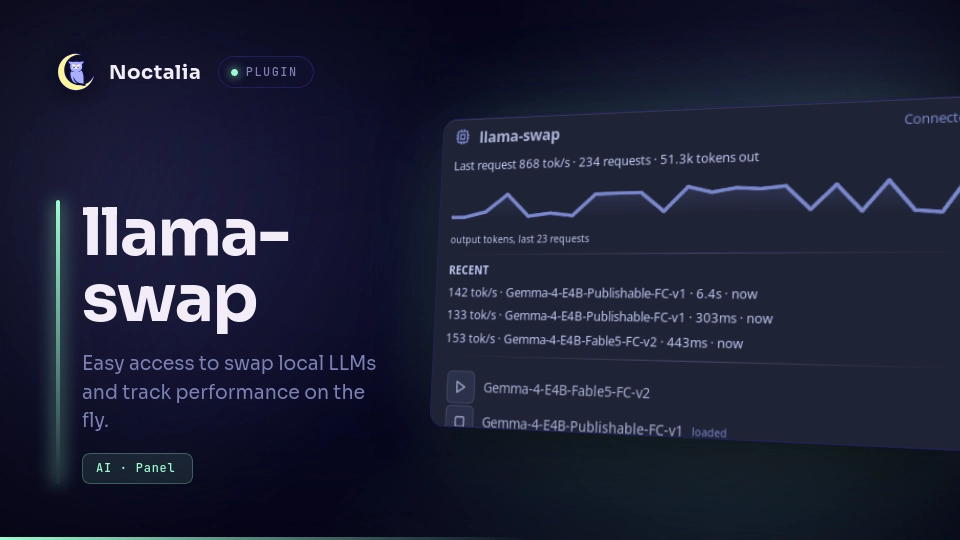

# llama-swap

Monitor and control a [llama-swap](https://github.com/mostlygeek/llama-swap)
server from the Noctalia bar. A `cpu` glyph shows live server state, and a
panel gives you a rolling output-token sparkline, recent request throughput,
and one-click load/unload for every configured model.



## Plugin

| Field | Value |
| --- | --- |
| ID | `carlocamacho/llama-swap` |
| Entries | Bar widget: `status`; panel: `manager`; service: `poller` |

## Requirements

A running llama-swap server (tested with llama-swap v175+). No external
commands are needed — all communication is HTTP via Noctalia's runtime API.

- llama-swap default port: `8080`. If you run it elsewhere, change **Server
  URL** in settings.
- If your llama-swap config sets `apiKeys`, copy one into the **API key**
  setting; otherwise leave it empty.

## Usage

Enable the plugin, then add the `status` widget from Noctaria's bar widget
picker. Left-click the glyph to open the manager panel; right-click opens the
plugin settings.

Glyph colors:

| Color | Meaning |
| --- | --- |
| Primary (blue) | Server reachable, idle — no model loaded |
| Success (green) | Model ready and serving |
| Warning (amber) | Model loading or a load is pending |
| Error (red) | Server unreachable, auth failed, or request error |

The panel shows:

- **Summary line** — last request throughput plus total requests and output
  tokens served since llama-swap started.
- **Sparkline** — output tokens per request over the last 24 requests
  (sqrt-scaled so small requests stay visible next to large ones).
- **RECENT** — the three most recent requests with throughput, model, latency
  and age.
- **Model list** — every model configured in llama-swap with play/stop
  buttons. Loading warms the model via `/upstream/{id}/v1/models` (the same
  call llama-swap's own web UI makes); unloading uses
  `POST /api/models/unload/{id}`. Model IDs containing slashes are handled.

Open or close the panel without the bar widget:

```sh
noctalia msg panel-toggle carlocamacho/llama-swap:manager
```

## Settings

| Setting | Type | Default | Description |
| --- | --- | --- | --- |
| `server_url` | `string` | `http://localhost:8080` | Base URL of the llama-swap server. Trailing slashes are stripped. |
| `api_key` | `string` | *(empty)* | Bearer token sent on every request. Leave empty when llama-swap has no `apiKeys`. |
| `refresh_interval` | `int` | `5` | Polling period in seconds (3–120). Each poll hits 4 lightweight endpoints. |
| `show_loaded_model` (widget) | `bool` | `true` | Show the ready model's name in the bar next to the glyph. |

## IPC

The bar widget accepts a `refresh` event:

```sh
noctalia msg plugin carlocamacho/llama-swap:status all refresh
```

## Notes

- Network: the service polls `/v1/models`, `/running`, `/api/metrics/stats`
  and `/api/metrics/activity` every refresh interval, and the panel issues
  one-off load/unload calls on click. No other network activity.
- Filesystem: none. Process spawning: none.
- Load requests are tracked optimistically; if a model does not reach
  `ready` within 3 minutes you get an error notification.
- Model list order and content come straight from llama-swap's
  configuration; add or remove models in `config.yaml`, not here.

## License

[MIT](LICENSE)
